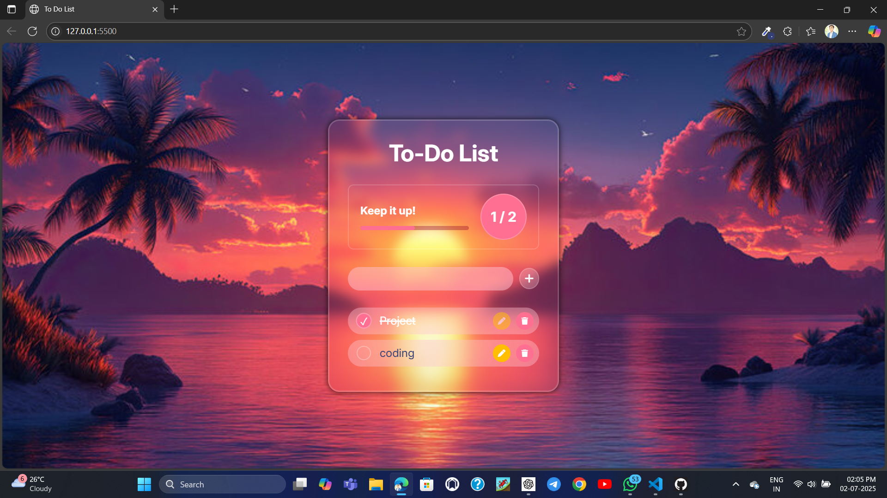

# 📝 To-Do List Interactive Webpage

A simple, responsive, and interactive To-Do List web application built using **HTML**, **CSS**, and **JavaScript**. This project allows users to add, delete, and manage tasks efficiently, making productivity fun and organized!

## 🔗 Live Demo

[Click here to try the app](https://yogeshmaske001.github.io/To-Do-List/)  
 

---

## 📸 Preview

  
 

---

## 🚀 Features

- ✅ Add new tasks
- ✏️ Mark tasks as completed
- ❌ Delete tasks
- 💾 LocalStorage support (optional)
- 📱 Responsive design for mobile and desktop
- ⌨️ "Enter" key support for quick task addition

---

## 🛠️ Built With

- **HTML5** – Structure of the webpage
- **CSS3** – Styling with responsiveness and hover effects
- **JavaScript (Vanilla JS)** – DOM manipulation and interactivity

---

 
